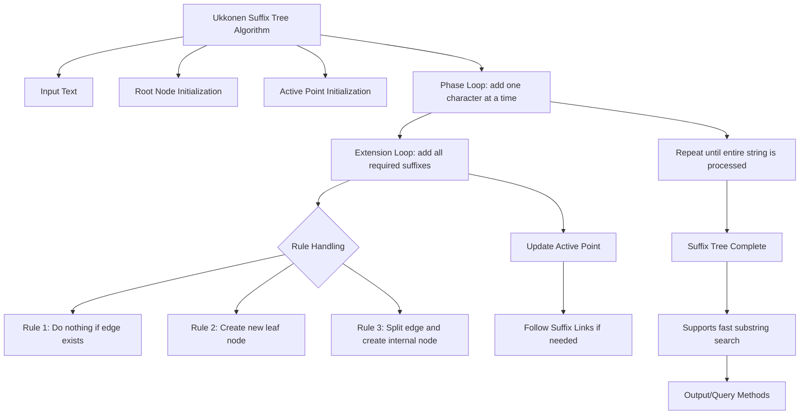

# Suffix Tree Implementation in JavaScript (Ukkonen's Algorithm)

This project demonstrates how to **build a full suffix tree** using **Ukkonen’s algorithm** and test it with **large text inputs**.

---

## 📌 Task Description

**Problem:**  
Given a string `s`, construct a **suffix tree** that represents all suffixes of `s` in **linear time** using **Ukkonen's algorithm**.

**Requirements:**
1. Support **large texts** efficiently (e.g., documents, genome sequences).
2. Allow **searching substrings** in O(m) time (where m is the substring length).
3. Include **unit tests** to verify correctness.

**Example:**

```javascript
Input: s = "banana"
Suffixes: "banana", "anana", "nana", "ana", "na", "a"
```

## The suffix tree represents all these suffixes in a tree structure, sharing common prefixes.

Approach: Ukkonen's Algorithm
- Incremental construction: Add one character at a time.
- Active point: Keep track of current position in tree.
- Suffix links: Allow fast traversal from one suffix to another.
- End of phase: Insert all suffixes ending at the current character.
- Linear-time complexity O(n), where n is the length of the string.

Full implementation is complex; for medium-sized projects, simplified or partial suffix tree variants can also be tested.

## Implementation Notes (JavaScript)

- Nodes: Objects storing children (edges), start/end indices, and suffix links.
- Edges: Represent substrings of the original string (start to end indices). 
- Active Point: {node, edge, length} structure.
- Suffix Links: Pointers from internal nodes to speed up tree construction.

# Project Overview



###  How this works

- `A` is the **main project** node.
- Each child (B, C, D, E) is a **task/file**.
- Subnodes show **methods/functions** and **example usage**.
- You can copy-paste this directly into **GitHub README** or **VS Code Markdown Preview**.  
