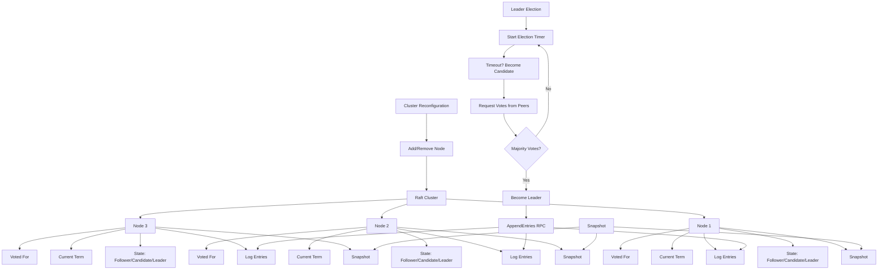

# Raft Consensus Algorithm Library (Production-Grade)

This project implements a **production-grade Raft library** in JavaScript/Node.js, covering **leader election, log replication, cluster reconfiguration, and snapshots**.


## Task Description

**Problem:**  
Implement a distributed consensus library based on the **Raft algorithm** that supports:

1. **Leader Election** – nodes elect a leader to coordinate log replication.
2. **Log Replication** – leader replicates client commands to follower nodes.
3. **Cluster Reconfiguration** – dynamically add or remove nodes without compromising safety.
4. **Snapshots** – compress log history to reduce memory/disk usage for long-running systems.

**Goals:**

- Safety: no two leaders at the same time, logs consistent.
- Liveness: clients eventually see committed entries.
- Fault-tolerance: tolerate failures up to ⌊(N-1)/2⌋ nodes.


##  Core Components

### 1. Node

- Maintains **state**: `Follower`, `Candidate`, `Leader`.
- Tracks **current term**, **votedFor**, **log entries**.
- Handles RPCs: `RequestVote` and `AppendEntries`.

### 2. Leader Election

- Timeout-based elections.
- Candidate requests votes from other nodes.
- Leader established if **majority votes** received.

### 3. Log Replication

- Leader appends client commands to its log.
- Sends `AppendEntries` RPCs to followers.
- Followers append and acknowledge logs.
- Leader commits entries after **majority replication**.

### 4. Reconfiguration

- Supports **joint consensus** to safely add/remove nodes.
- Ensures logs remain consistent during topology changes.

### 5. Snapshots

- Periodically snapshot state to reduce log size.
- Follower can install snapshot if missing log entries.


##  Architecture Overview

```javascript
Raft Node
├─ State: Follower / Candidate / Leader
├─ Log: [term, command]
├─ Current Term
├─ Voted For
├─ RPCs:
│ ├─ RequestVote
│ └─ AppendEntries
└─ Snapshot Management
```

## Mermaid Diagram

